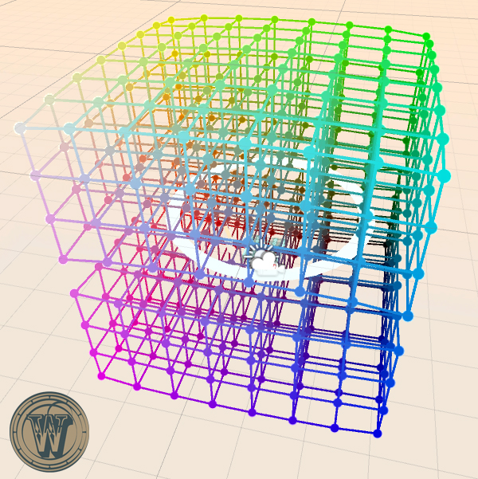

# Prototype Color Cube

### Tech

- Unity 5.5.1
- Oculus Utilities 1.11.0
- Oculus Avatar sdk 1.10.1 (for Oculus Touch)

### Design

The Color Cube prototype is a Virtual Reality experience in Oculus Rift that aims to illustrate the concept of binary search.

In this prototype, the guest will be standing in the middle of a three-dimensional color gradient, will attempt to find a particular color by dividing the cube in two and selecting the half they think contains their target color. The guest will check color/ check target/ split cube(release a magic) all by hand gestures.

### Todos

 - Cancel last split
 - Better UI
 - ...

### Credit

This project is a joint effort of members within Team Wonderland:
- Miram Harries (Producer)
- Beiqi(Nick) Guan
- Guanqiao(Joe) Wang
- Jiawen Liang
- Luqing(Luna) Zhang
- Zhi(Zach) Ai
